

# Dev_Setup
Setup Development Environment

#Assignment: Setting Up Your Developer Environment

#Objective:
This assignment aims to familiarize you with the tools and configurations necessary to set up an efficient developer environment for software engineering projects. Completing this assignment will give you the skills required to set up a robust and productive workspace conducive to coding, debugging, version control, and collaboration.

#Tasks:

1. Select Your Operating System (OS):
   Choose an operating system that best suits your preferences and project requirements. Download and Install Windows 11. https://www.microsoft.com/software-download/windows11

   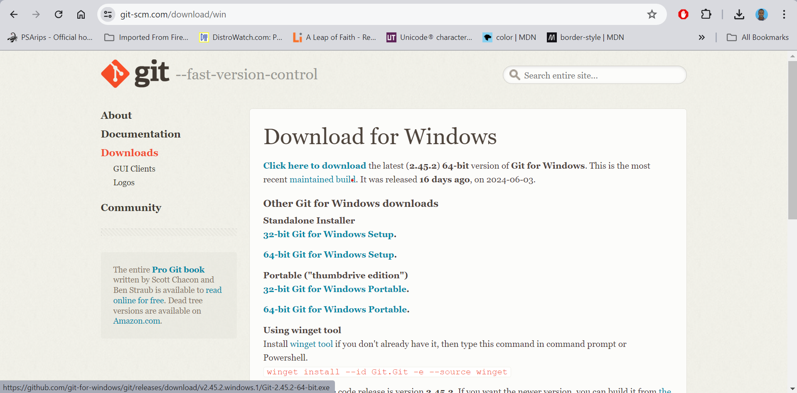

2. Install a Text Editor or Integrated Development Environment (IDE):
   Select and install a text editor or IDE suitable for your programming languages and workflow. Download and Install Visual Studio Code. https://code.visualstudio.com/Download
   
   Steps to install VS Code
            Run the Installer:
            Run the downloaded installer.
            Choose the "Visual Studio" workload during installation, which includes the necessary components for general development.
            Select Workloads and Components:
            In the Visual Studio Installer, select the workloads and components you need based on your development requirements. Common workloads include ".NET Desktop Development" or "Web Development."
            Install:
            Click the "Install" button to start the installation process.
            This may take some time, as it involves downloading and installing the selected components.
            Launch Visual Studio:
            Once the installation is complete, launch Visual Studio.
            Sign in with your Microsoft account or create one if prompted.
      
3. Set Up Version Control System:
   Install Git and configure it on your local machine. Create a GitHub account for hosting your repositories. Initialize a Git repository for your project and make your first commit. https://github.com
   
   Visit https://git-scm.com and click "Download" for Windows. 
   Double-click the downloaded Git-x.y.z-64-bit.exe file to start the installation.
   Click "Yes" on the UAC prompt and "Next" on the setup wizard.
   Accept the default installation location or choose a different one, then click "Next."
   Choose default components and click "Next."
   Accept the default Start Menu folder and click "Next."
   Select "Git from the command line and also from 3rd-party software" and click "Next."
   Click "Install" to begin the installation.
   Check "Launch Git Bash" and click "Finish."

   Configuring Git on Your Local Machine.
   Launch Git Bash from the Start Menu and run it as administrator.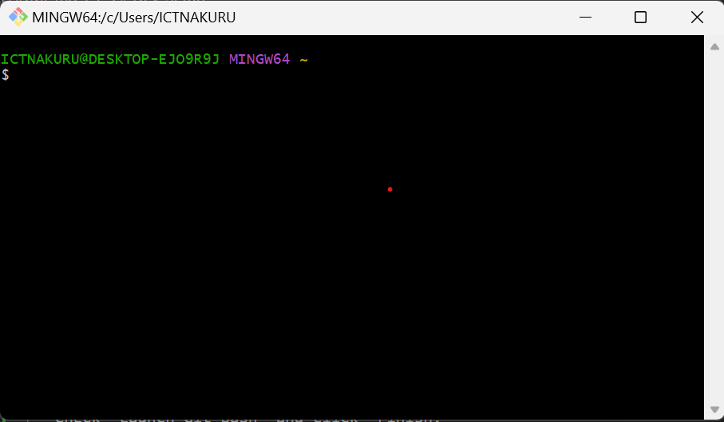
   Type git --version in Git Bash and press Enter to confirm installation 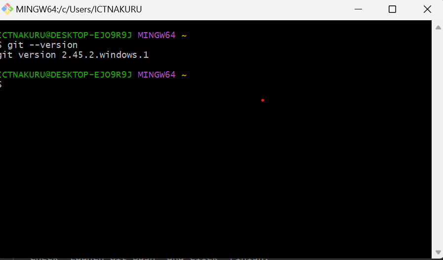
   Run git config --global user.name "Your Name" and git config --global user.email "your.email@example.com" in Git Bash. 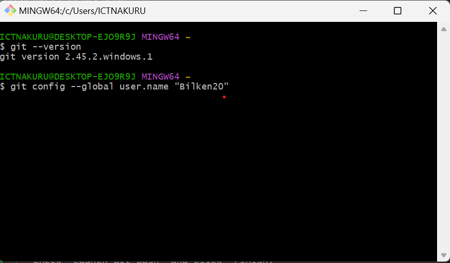, 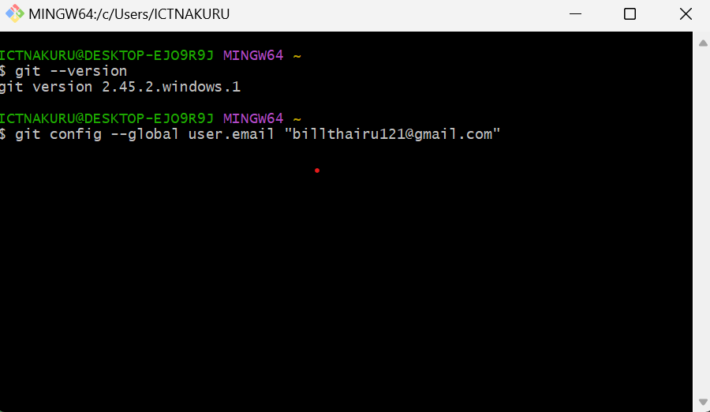
   Run git config --list to verify settings. 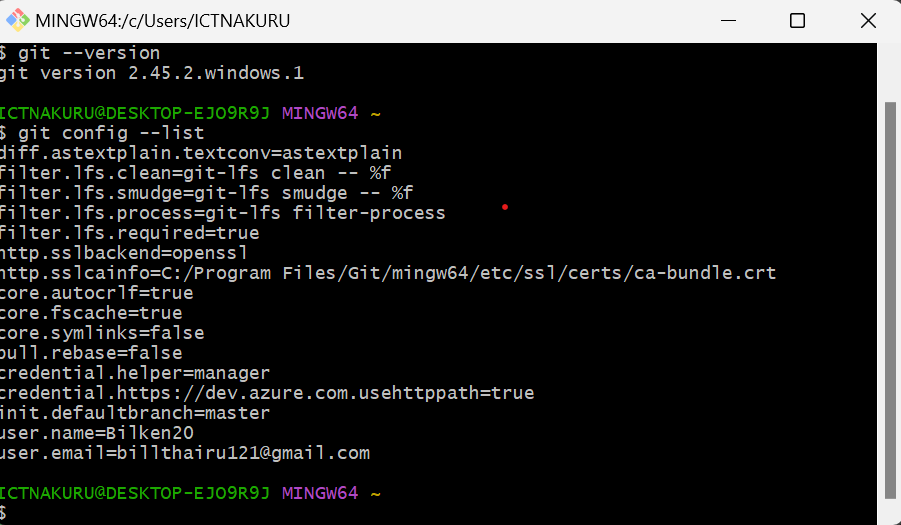

4. Install Necessary Programming Languages and Runtimes:
  Instal Python from http://wwww.python.org programming language required for your project and install their respective compilers, interpreters, or runtimes. Ensure you have the necessary tools to build and execute your code.

   Visit https://www.python.org and click on "Downloads," then select "Download Python x.y.z" for Windows. 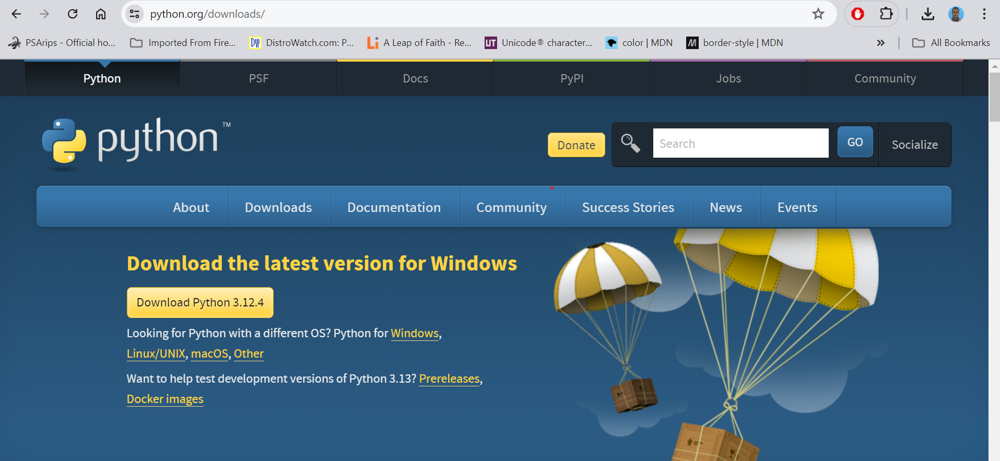
   Double-click the downloaded python-x.y.z-amd64.exe file to start the installation.
   Check the "Add Python x.y.z to PATH" box and click "Install Now."
   Click "Yes" on the UAC prompt to allow the installation.
   Wait for the installation to complete and click "Close."
   Run python --version on gitbash to verify installation. 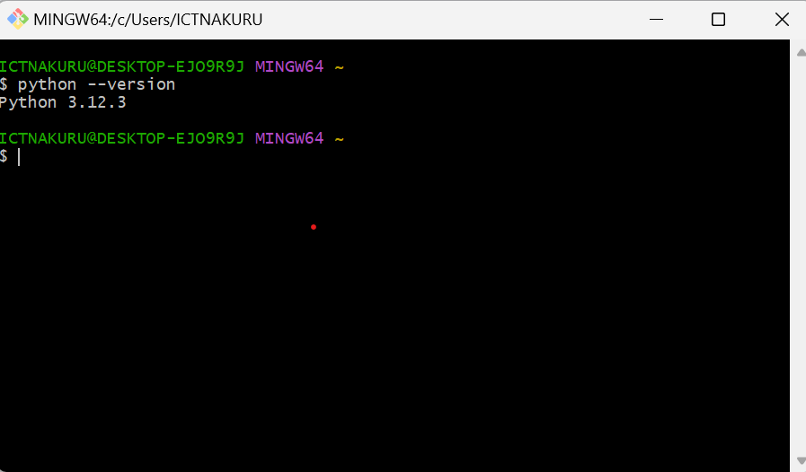

5. Install Package Managers:
   If applicable, install package managers like pip (Python).
   Run gitbash as administrator and enter the following command to install pip winget install pip. 
   ! [install pip](image-9.png)

6. Configure a Database (MySQL):
   Download and install MySQL database. https://dev.mysql.com/downloads/windows/installer/5.7.html, 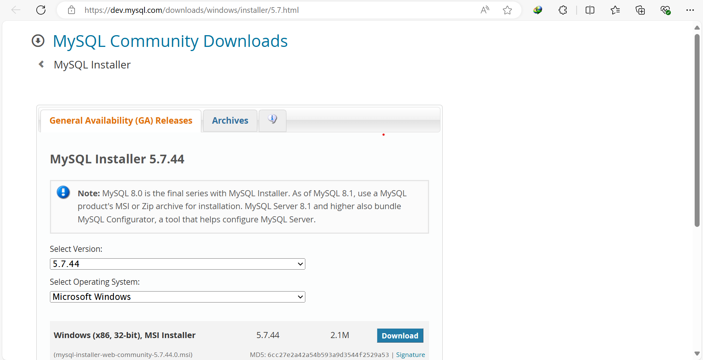
   Double-click the downloaded mysql-installer-web-community-x.y.z.msi file to start the installation.
   Select "Custom" setup type to choose specific components and click "Next."
   Choose "MySQL Server" and any other desired components (e.g., Workbench, Shell) and click "Next.
   The installer will check for any required software; install any missing prerequisites and click "Next."
   Click "Execute" to begin the installation of selected products. 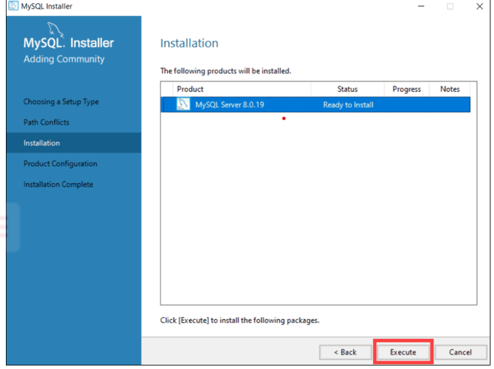
   Select "Development Computer" for the config type, leave the port as 3306, ensure "Open Windows Firewall port for network access" is checked, and click "Next."
   Ensure "Configure MySQL Server as a Windows Service" is checked, and optionally, set a custom service name; click "Next." 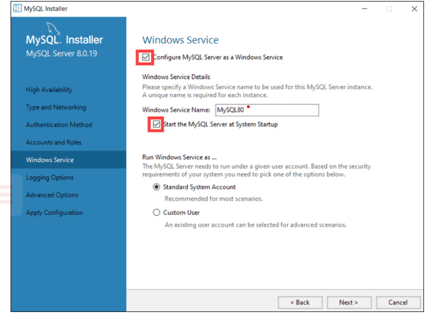
   Once the configuration is complete, click "Finish." 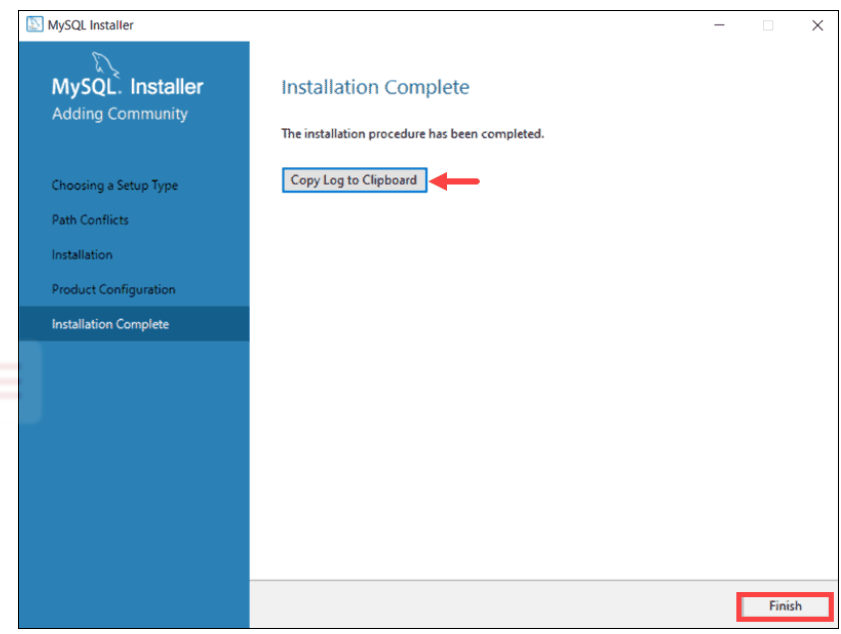

7. Set Up Development Environments and Virtualization (Optional):
   Consider using virtualization tools like Docker or virtual machines to isolate project dependencies and ensure consistent environments across different machines.

8. Explore Extensions and Plugins:
   Explore available extensions, plugins, and add-ons for your chosen text editor or IDE to enhance functionality, such as syntax highlighting, linting, code formatting, and version control integration.
   To improve functionality, the following extensions will be required:
   Python, Python Debugger and Pylance for python.
   Prettier Code Formatter to format code
   Dart & Flutter for dart and flutter programming.
   
   To install exntensions of VS Code:
   Use the keyboard shortcut CTRL + Shift + X to access the extensions panel.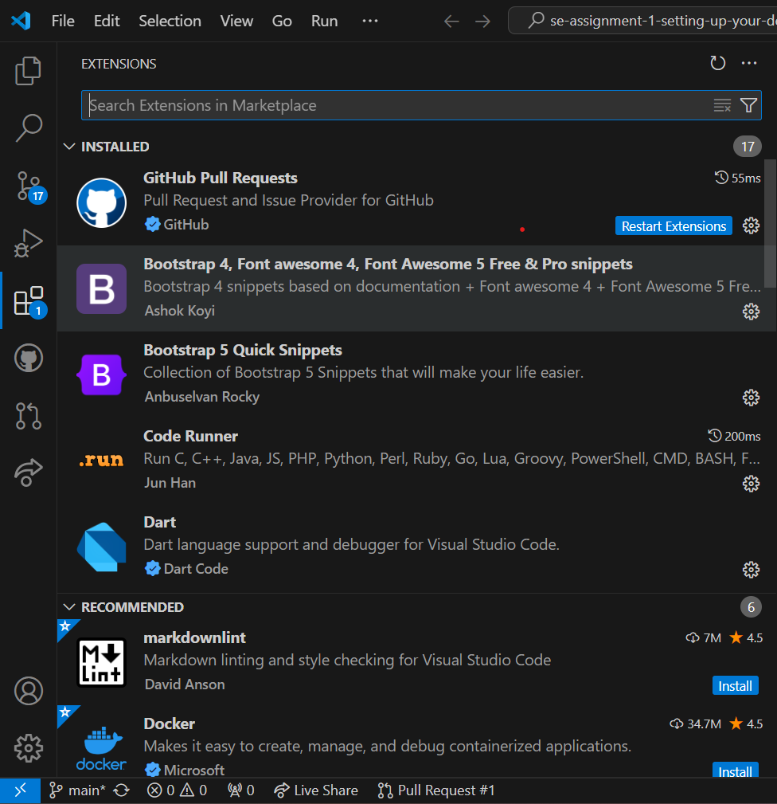
   Search for your extension. e.g Python, click on it then select install. 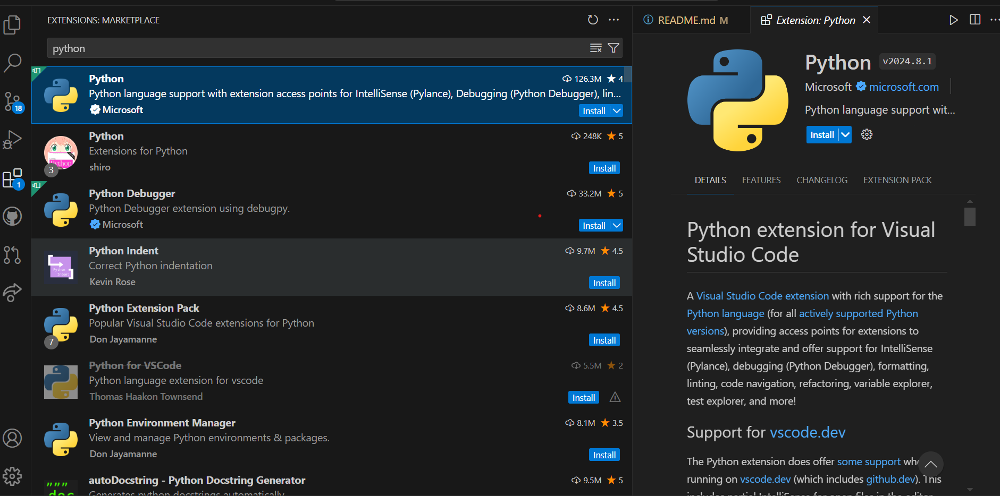

9. Document Your Setup:
    Create a comprehensive document outlining the steps you've taken to set up your developer environment. Include any configurations, customizations, or troubleshooting steps encountered during the process. 

#Deliverables:
- Document detailing the setup process with step-by-step instructions and screenshots where necessary.
- A GitHub repository containing a sample project initialized with Git and any necessary configuration files (e.g., .gitignore).
- A reflection on the challenges faced during setup and strategies employed to overcome them.

#Submission:
Submit your document and GitHub repository link through the designated platform or email to the instructor by the specified deadline.

#Evaluation Criteria:**
- Completeness and accuracy of setup documentation.
- Effectiveness of version control implementation.
- Appropriateness of tools selected for the project requirements.
- Clarity of reflection on challenges and solutions encountered.
- Adherence to submission guidelines and deadlines.

Note: Feel free to reach out for clarification or assistance with any aspect of the assignment.
