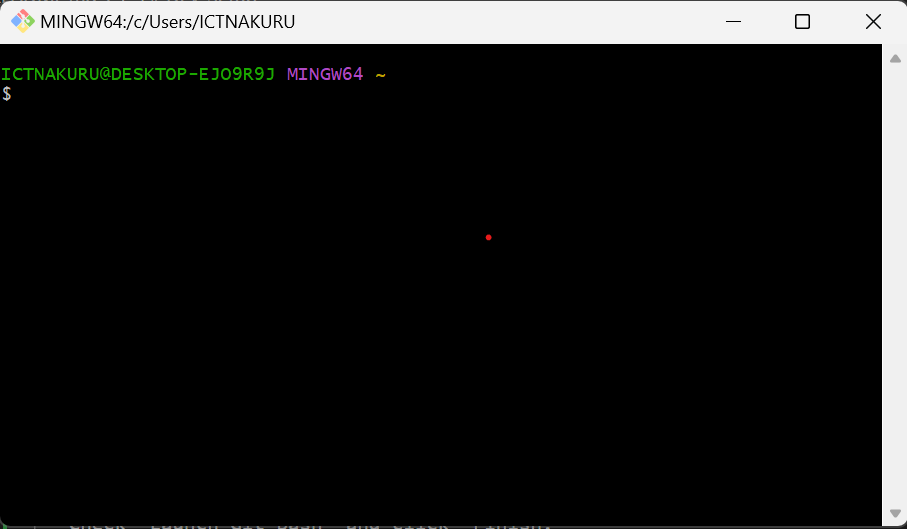
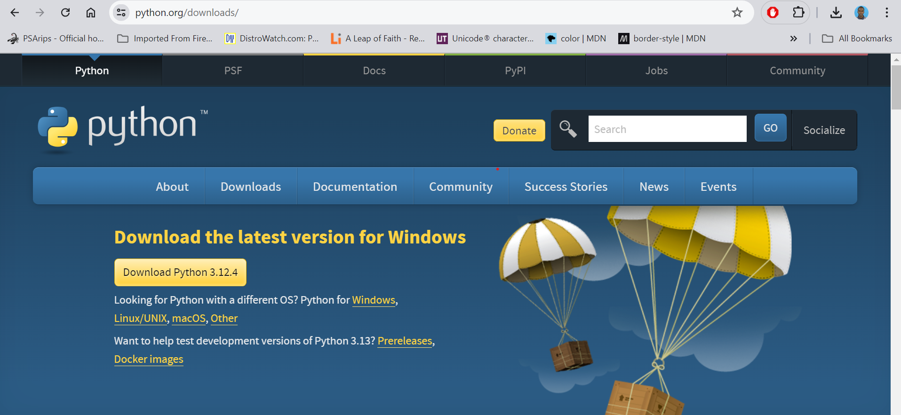
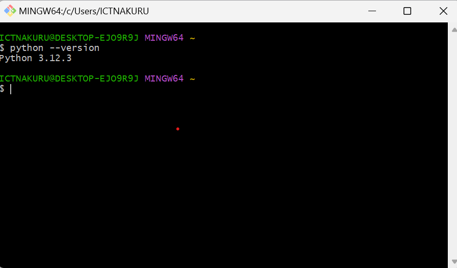
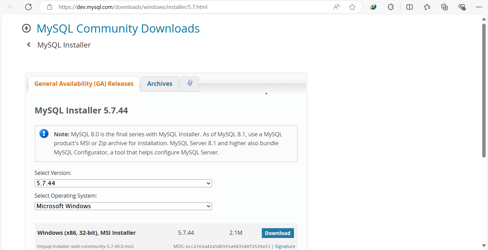
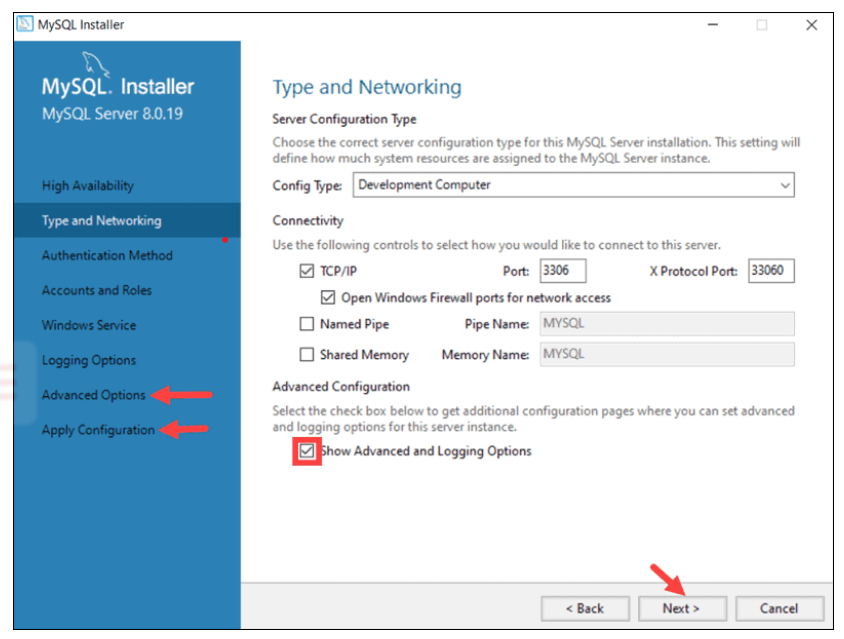
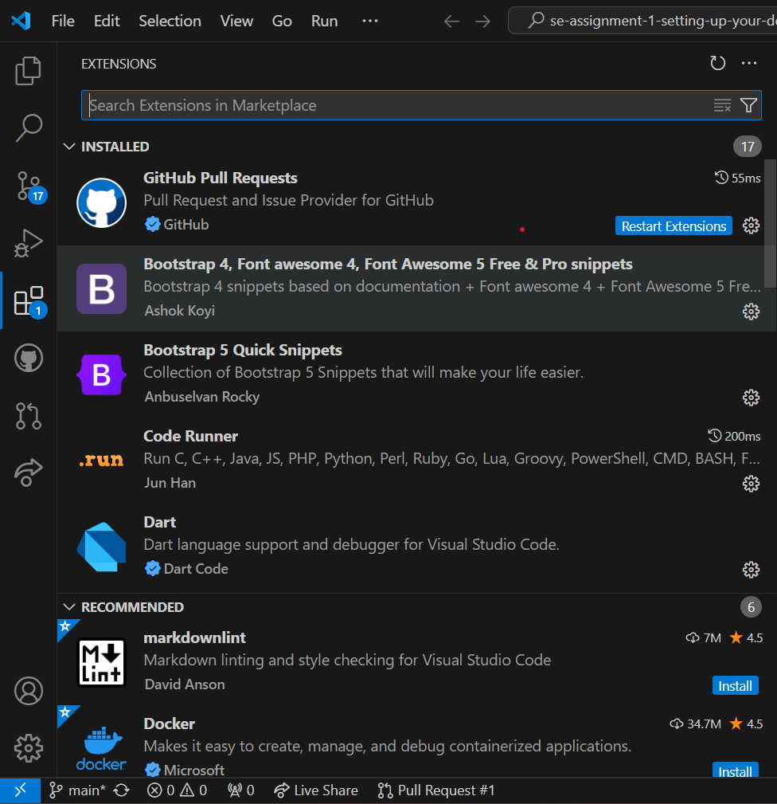

How to Set Up Your  Development Environment Guide.

Content
1. Selecting Your Operating System
2. Installing Visual Studio Code
3. Setting up Version Control Systems
4. Installing necessary Programming languages and runtimes
5. Installing Package Managers.
6. Configuring a Database. (MYSQL)
7. Exploring extensions and plugins on installed IDE.

INSTALLING AN OPERATING SYSTEM

Choose an operating system that best suits your preferences and project requirements. Download and Install Windows 11. https://www.microsoft.com/software-download/windows11
Create Installation Media: Obtain a Windows installation USB drive or DVD. You can create one using the Windows Media Creation Tool from Microsoft's official website.
Insert Installation Media:Insert the Windows installation USB drive or DVD into your computer.
Boot from Installation Media:Restart your computer and enter the BIOS or UEFI settings (usually by pressing a key like F2, F12, Esc, or Del during startup).Change the boot order to prioritize booting from the installation media (USB or DVD).
Start the Installation:Save the changes in BIOS/UEFI settings and restart your computer.
Windows setup should begin automatically. Follow the on-screen instructions.
Select Language and Region:Choose your language, time, and keyboard preferences.
Install Windows:Click on "Install Now" to begin the installation process.
Enter Product Key:Enter your Windows product key when prompted. You may skip this step if you are installing a trial or evaluation version.
Accept License Terms:Read and accept the Microsoft Software License Terms.
Choose Installation Type:Select "Custom: Install Windows only (advanced)" for a clean installation on a new drive or partition.
Partition the Drive:If required, create or select the partition where you want to install Windows. Click "Next" to start the installation.
Install Windows:Windows will copy files, install features, and update settings. Your computer may restart several times during this process.
Set Up Windows:Follow the prompts to personalize your Windows settings, such as creating a user account and configuring privacy options.
Go to system settings and check the version of windows installed.

INSTALLING VISUAL STUDIO CODE

Select and install a text editor or IDE suitable for your programming languages and workflow. Download and Install Visual Studio Code. https://code.visualstudio.com/Download
   
Steps to install VS Code
    Run the Installer:
    Run the downloaded installer.
    Choose the "Visual Studio" workload during installation, which includes the necessary components for general development.
    Select Workloads and Components:
    In the Visual Studio Installer, select the workloads and components you need based on your development requirements. Common workloads include ".NET Desktop Development" or "Web Development."
    Install: Click the "Install" button to start the installation process.This may take some time, as it involves downloading and installing the selected components.
    Launch Visual Studio:Once the installation is complete, launch Visual Studio.
    Sign in with your Microsoft account or create one if prompted.

SETTING UP VERSION CONTROL SYSTEMS

Visit https://git-scm.com and click "Download" for Windows. 
   Double-click the downloaded Git-x.y.z-64-bit.exe file to start the installation.
   Click "Yes" on the UAC prompt and "Next" on the setup wizard.
   Accept the default installation location or choose a different one, then click "Next."
   Choose default components and click "Next."
   Accept the default Start Menu folder and click "Next."
   Select "Git from the command line and also from 3rd-party software" and click "Next."
   Click "Install" to begin the installation.
   Check "Launch Git Bash" and click "Finish."

INSTALLING NECESSARY PROGRAMMING LANGUAGES AND RUNTIMES

Launch Git Bash from the Start Menu and run it as administrator.
Type git --version in Git Bash and press Enter to confirm installation 
Run git config --global user.name "Your Name" and git config --global user.email "your.email@example.com" in Git Bash. , 
Run git config --list to verify settings. 

INSTALLING PACKAGE MANAGERS

Visit https://www.python.org and click on "Downloads," then select "Download Python x.y.z" for Windows. 
Double-click the downloaded python-x.y.z-amd64.exe file to start the installation.
Check the "Add Python x.y.z to PATH" box and click "Install Now."
Click "Yes" on the UAC prompt to allow the installation.
Wait for the installation to complete and click "Close."
Run python --version on gitbash to verify installation. 

INSTALLING PACKAGE MANAGERS

If applicable, install package managers like pip (Python).
Run gitbash as administrator and enter the following command to install pip winget install pip.

CONFIGURING A DATABASE
Download and install MySQL database. https://dev.mysql.com/downloads/windows/installer/5.7.html, 
Double-click the downloaded mysql-installer-web-community-x.y.z.msi file to start the installation.
Select "Custom" setup type to choose specific components and click "Next."
Choose "MySQL Server" and any other desired components (e.g., Workbench, Shell) and click "Next.
The installer will check for any required software; install any missing prerequisites and click "Next."
Click "Execute" to begin the installation of selected products. 
Select "Development Computer" for the config type, leave the port as 3306, ensure "Open Windows Firewall port for network access" is checked, and click "Next.", 
Ensure "Configure MySQL Server as a Windows Service" is checked, and optionally, set a custom service name; click "Next." 
Once the configuration is complete, click "Finish." 

EXPLORING EXTENSIONS AND PLUGINS ON INSTALLED IDE.

To improve functionality, the following extensions will be required:
Python, Python Debugger and Pylance for python.
Prettier Code Formatter to format code
Dart & Flutter for dart and flutter programming.
   
To install exntensions of VS Code:
Use the keyboard shortcut CTRL + Shift + X to access the extensions panel.
Search for your extension. e.g Python, click on it then select install. 
